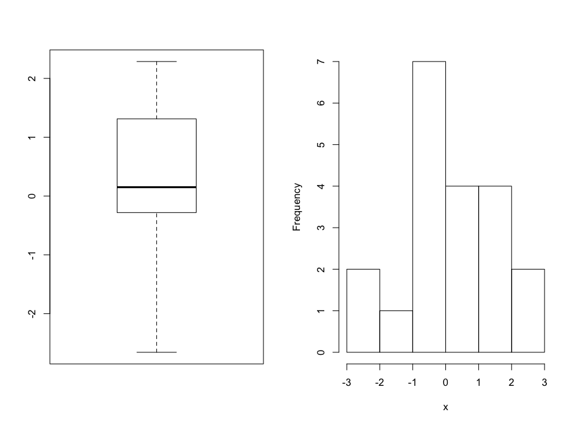

## A Plot

--- .quote

<q>If you’re thinking without writing, you only think you’re thinking. – Leslie Lamport</q>

--- {class: class1, bg: cyan, id: id1}

## Slide Title

Slide Contents

---

## Mathjax ##

$$
\begin{aligned}
\nabla \times \vec{\mathbf{B}} -\, \frac1c\, \frac{\partial\vec{\mathbf{E}}}{\partial t} & = \frac{4\pi}{c}\vec{\mathbf{j}} \\   \nabla \cdot \vec{\mathbf{E}} & = 4 \pi \rho \\
\nabla \times \vec{\mathbf{E}}\, +\, \frac1c\, \frac{\partial\vec{\mathbf{B}}}{\partial t} & = \vec{\mathbf{0}} \\
\nabla \cdot \vec{\mathbf{B}} & = 0 \end{aligned}
$$

---
<q style="margin-left:140px;">The overriding design goal for Markdown’s formatting syntax is to make it as readable as possible. The idea is that a Markdown-formatted document should be publishable as-is, as plain text, without looking like it’s been marked up with tags or formatting instructions.</q>
